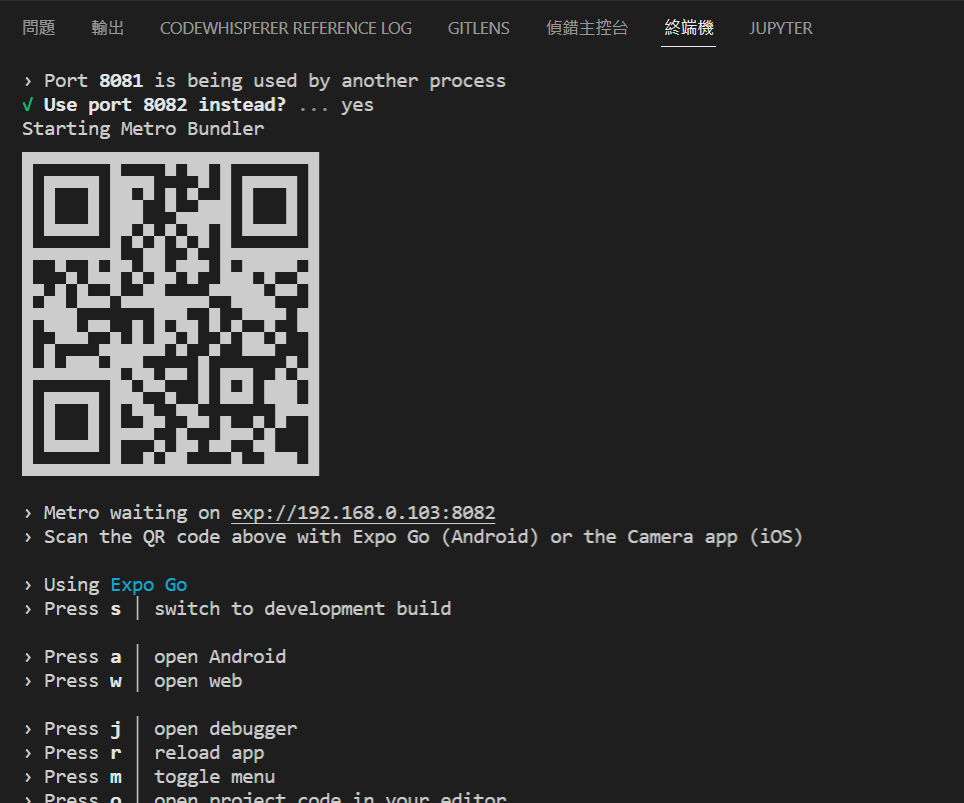
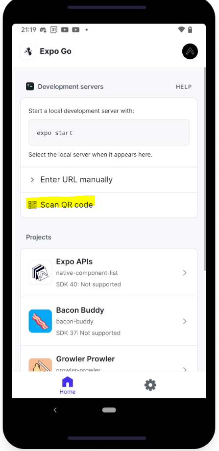
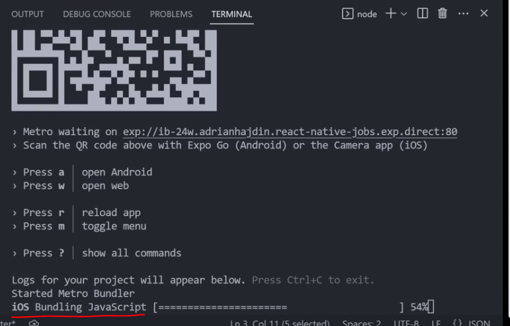

# w101 mobile

## 簡介
此專案使用 React-Native 撰寫，透過 expo Go 快速建立開發環境。

更多的介紹與說明，可到下列網站了解
https://reactnative.dev/docs/environment-setup

## 專案下載位置

> https://github.com/paul61843/w101_mobile

## 版本資訊

    nodeJS v18.16.0

    "expo": "~49.0.7",
    "expo-status-bar": "~1.6.0",
    "react": "18.2.0",
    "react-native": "0.72.4",
    "react-native-webview": "13.2.2"
    "@babel/core": "^7.20.0"

## 執行 React Native

1. 於專案目錄中下指令
    > npx expo start

2. 執行成功後，會出現下列有QrCode 的畫面
    

3. 手機安裝 Expo Go app，開啟 app 後點擊 Scan QR code，

    如圖螢光筆位置

    Expo Go app 連結
    https://expo.dev/client

    

4. app 分享熱點給電腦 
備註: 手機需跟電腦有相同網路，才能建置app

5. app 掃描 QrCode，成功後會出現 building 的文字
    
## 結尾
如果還有問題的話，可以參考這部影片
18:18 ~ 19:20
https://youtu.be/mJ3bGvy0WAY?t=1096